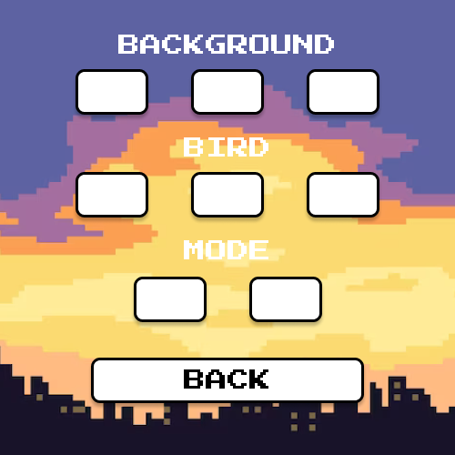

# FlappyBird

Реализация знаменитой игры Flappy Bird для pip репозитория с расширенными возможностями:
- Изменение препятствий
- Изменение фона
- Изменение птички (на корову ы)
- Добавление нового функционала (придумаем по ходу дела :) - может быть вместо колонн летящие птеродактели)

Дополнительно:
- Возможность регистрации (хотя бы просто по логину (мб гугл?))
- Просмотр рейтинга по всем пользователям

Предполагаемые инструменты:
- Локальный пакетный менеджер pulp, для публикации игры в pip репозитории
- PyGame
- ...

Примерный макет приложения:

