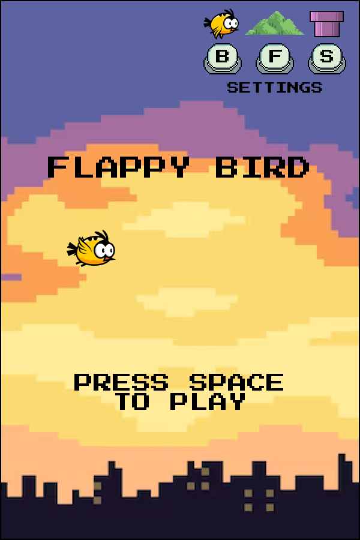
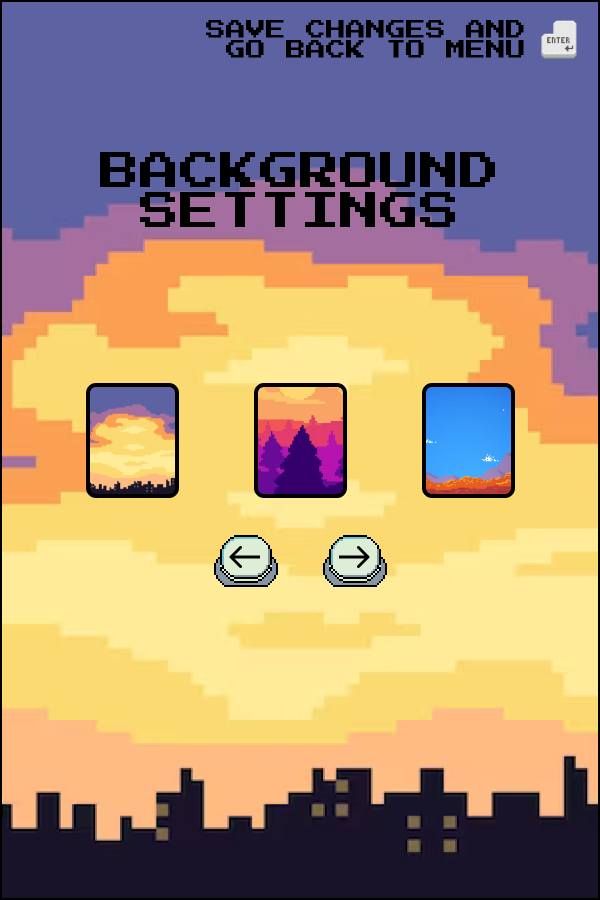
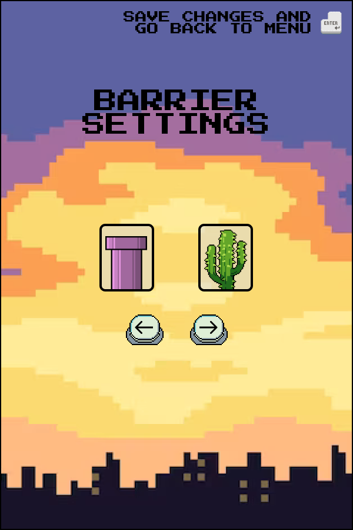
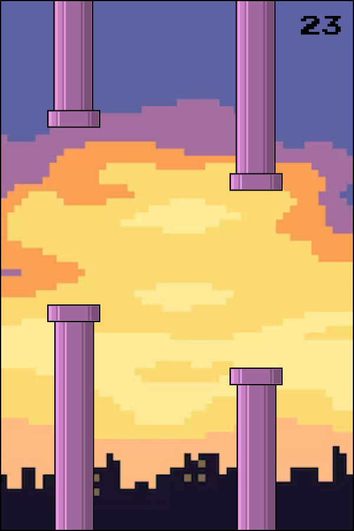
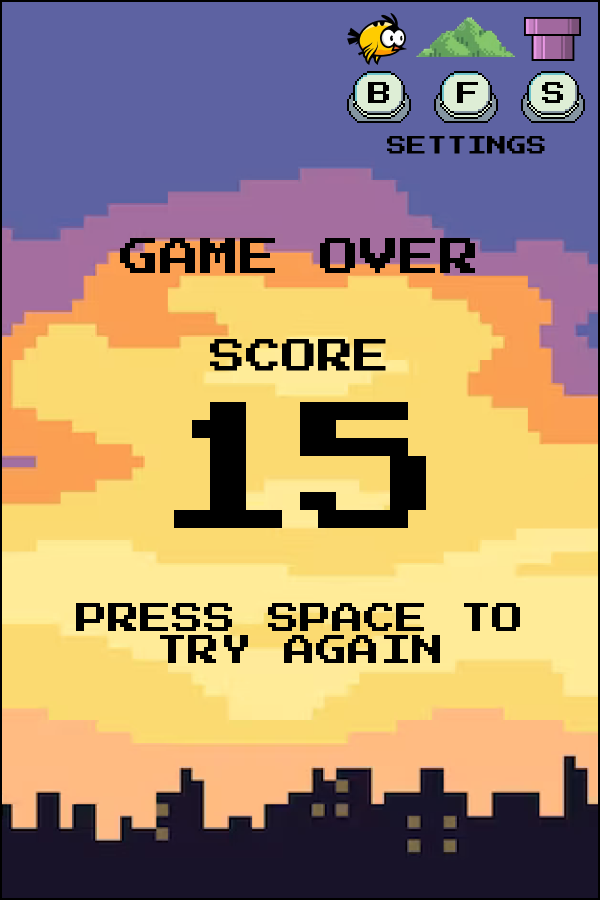

# FlappyBird

## Реализация знаменитой игры Flappy Bird для pip репозитория с расширенными возможностями:

- Изменение препятствий
- Изменение фона
- Изменение птички

## Предполагаемые инструменты:

- PyGame

## Управление и сборка:
Виртуальное окружение:
```
pipenv shell
pipenv install 
```
Для взаимодействия с проектом используется утилита **doit**:
- ```doit list``` - Список доступных команд
- ```doit check_style``` - Проверка код-стайла 
- ```doit format``` - Форматирование кода по стандарту pep8
- ```doit gitclean``` - Удаление файлов, которые не находятся в git
- ```doit html_en``` - Генерация документации на английком языке
- ```doit html_ru``` - Генерация документации на русском языке
- ```doit play``` - Запуск игры из проекта
- ```doit tests``` - Запуск тестов
- ```doit build``` - Генерация .whl пакета

## Сборка документации:
```
doit html_en или
doit html_ru
```
Документация будет сгенерирована в docs/build/html

## Сборка пакета:
```doit build```
.whl пакет будет сгенерирован в директории /dist

### Установка и запуск:
Рекомендуется создать отдельное виртуальное окружение:
```pipenv shell```

Установить .whl пакет:
```pip install /PATH/TO/FlappyBird/dist/пакет.whl```

Запуск игры:
```python -m FlappyBird```

## Макет приложения:

Figma проекта: https://www.figma.com/file/IE0SeKEI8i1PB8rBS9ueCF/Flappy-Bird?type=design&node-id=0%3A1&t=qzEJch6JvpPNb4lS-1

### Главная страница



### Настройки птички


### Настройки фона



### Настройки препятствий



### Процесс игры



### Окончание игры



# Документация

https://github.com/TheFieryLynx/FlappyBird/wiki/Documentation
