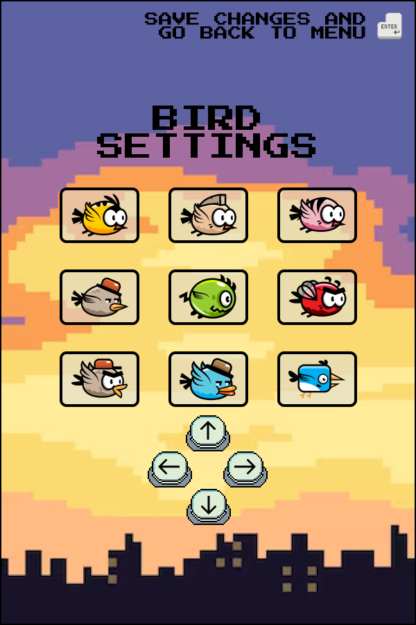

# FlappyBird

## Реализация знаменитой игры Flappy Bird для pip репозитория с расширенными возможностями:

- Изменение препятствий
- Изменение фона
- Изменение птички
- Добавление нового функционала (придумаем по ходу дела :) - может быть вместо колонн летящие птеродактели

## Дополнительно:

- Возможность регистрации (хотя бы просто по логину (мб гугл?))
- Просмотр рейтинга по всем пользователям

## Предполагаемые инструменты:

- Локальный пакетный менеджер pulp, для публикации игры в pip репозитории
- PyGame
- ...

## Макет приложения:

### Главная страница

### Настройки птички

### Настройки фона

### Настройки препятствий

### Процесс игры

### Окончание игры

# Документация

https://github.com/TheFieryLynx/FlappyBird/wiki/Documentation
